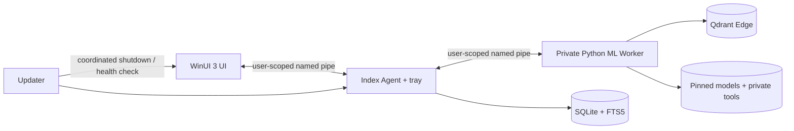

# Architecture

## Frozen architecture gate (protocol generation 1)

The system has four trust-separated processes. The WinUI UI is a single-instance interactive client. The Agent owns the durable queue, discovery, checkpoints and tray controls. The private-Python Worker owns FFmpeg probing, scene/OCR/audio inference and local Qdrant Edge access. The Updater is invoked only with a verified update plan and performs shutdown, replacement, health check and rollback.

All process communication uses Windows named pipes scoped to the current user. The pipe security descriptor admits only the owning SID and LocalSystem. Messages are UTF-8 JSON frames prefixed by a 32-bit little-endian byte count, limited to 1 MiB. Every envelope carries `protocolVersion`, `requestId`, optional `taskId`, UTC timestamp, stage, progress, recoverability and a stable error. Unknown additive fields are ignored; a different major protocol is rejected with `IPC_PROTOCOL_INCOMPATIBLE`.

## Storage and recovery

`catalog.db` is authoritative for assets, streams, libraries, jobs, checkpoints, segments, transcripts, OCR, model/index versions, settings, failures and migrations. FTS5 contains filename, normalized text, pinyin, initials and fuzzy-phonetic fields. Qdrant collections are derived stores keyed by deterministic segment IDs. A committed SQLite outbox records vector upserts/deletes; recovery replays it idempotently. This avoids a distributed transaction between SQLite and Qdrant.

Jobs lease one item at a time. A lease has an owner, expiry and monotonic attempt count. On restart, expired `running` items return to `queued`; completed checkpoints are never recomputed unless input fingerprint or algorithm/model version changed. Retry policy is bounded and error-code based. OOM reduces a batch once per attempt and ultimately creates a recoverable failure rather than an infinite loop.

Asset identity uses canonical volume-aware path plus size, modified time and a fast first/middle/last-block fingerprint. Full SHA-256 resolves suspected duplicates. Directory traversal records file IDs to prevent reparse-point cycles. Offline roots are marked unavailable and are not interpreted as deletions.

## Index algorithms

Visual candidates are detected at approximately 2 FPS, threshold 27. Windows are clamped to 2–8 seconds; longer scenes are subdivided. Every window has a midpoint frame and high-motion windows add a second representative. Whisper preserves original VAD segments and word timestamps; adjacent originals may form 8–30 second semantic windows with explicit original-ID mappings. OCR runs on representative/subtitle-change frames and stores text, normalized form, confidence, timestamp and bounding boxes.

Search runs independent filename FTS, text-to-visual, transcript semantic, OCR text/vector and optional phonetic recall. Reciprocal Rank Fusion uses `1/(60+rank)`, source weights and an exact-match boost. Contributions are retained for the explanation. Phonetic expansion is local, capped at eight candidates and never overwrites the transcript.

## Lifecycle boundaries

Closing the UI does not stop the Agent. Explicit Agent exit drains the current atomic checkpoint and stops the Worker. Search stays disabled until every initial asset has reached completed, skipped or user-confirmed-failed. Without CUDA, the Agent rejects any speech job with `CAPABILITY_SPEECH_REQUIRES_CUDA`, regardless of settings provenance.

The Updater downloads to a versioned staging directory, verifies manifest signature, archive hash and archive signature, checks disk capacity and database compatibility, then asks all processes to exit. It renames the current version to `previous`, atomically promotes staging, launches a health probe and rolls back on timeout/failure. It never silently installs or restarts.

## Version table

| Contract | Version |
|---|---:|
| IPC envelope | 1.0 |
| settings schema | 1 |
| model/dependency manifest | 1 |
| update manifest | 1 |
| diagnostics report | 1 |
| SQLite schema | 1 |
| visual segmentation | 1 |
| speech window mapping | 1 |
| OCR normalization | 1 |
| ranking | 1 |

