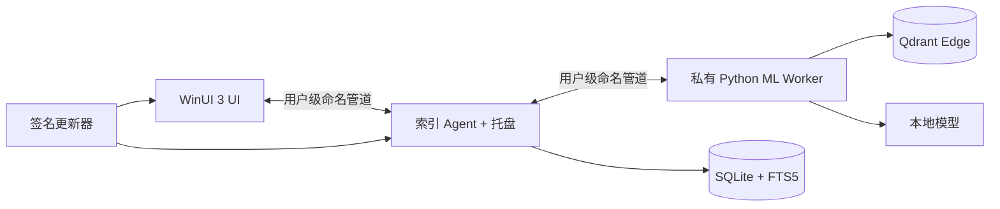

<p align="right"><strong>简体中文</strong> · <a href="README_EN.md">English</a></p>

# MLCCS Video Search

<p align="center">
  
</p>

<p align="center">
  面向 Windows 10/11 的本地视频语义检索工具。<br>
  使用文件名、画面、语音与 OCR 字幕查找视频片段，索引和检索数据默认保留在本机。
</p>

<p align="center">
  
  
  
  
</p>

> [!WARNING]
> 本项目仍在持续开发和优化阶段。当前版本可能仍然存在稳定性、兼容性和功能性问题，不建议将其视为关键数据工作流中的成熟产品。欢迎通过 GitHub Issues 指出问题、提出修改意见或分享改进建议。

## 演示视频

[▶ 播放或下载样本演示视频（MP4，约 33.5 MiB）](samples/mlccs-video-search-demo.mp4)

该视频来自项目最终 Windows 验收阶段的实际操作录屏，已随仓库保存，便于直接了解索引、资源库和搜索体验。

## 功能

- 本地视频资源库：支持多个本地盘或网络盘文件夹，并可按资源文件夹精确筛选。
- 多模态搜索：组合文件名、画面语义、语音转写、OCR 字幕和拼音召回。
- 高性能索引：定位采样、多视频并行、CUDA 自适应批处理与显存不足自动降批。
- 流式界面：资源库网格和列表按可见区域生成预览，避免一次性解码全部缩略图。
- 可恢复后台任务：Agent 持久化队列、断点和失败状态，关闭 UI 不会丢失索引进度。
- 本地优先隐私：媒体、查询、转写和向量不上传；诊断包只有在用户明确确认后才会提交。
- 可验证分发：在线安装器校验每个组件的大小与 SHA-256，支持断点续传、暂停、取消和卸载。

## 安装

当前公开测试版本为 `0.3.0-feedback5`：

[下载 Windows 在线安装器](https://lixinchen.ca/docs/mlccs-video-search/0.3.0-feedback5/MLCCS-VideoSearch-Online-Setup.exe)

- 支持：Windows 10/11 x64。
- 安装器大小：`143,943,908` 字节。
- 安装器 SHA-256：`8350e9e39062f88ffda1f46def307300575f84c76eea2284829f311ed5e89962`。
- 首次安装按选择下载应用核心、私有运行时、视觉模型及可选 OCR 模型。
- 语音索引需要兼容的 NVIDIA GPU 与 CUDA 运行能力；系统无需预装 Python、FFmpeg 或 .NET SDK。

完整发布记录和组件哈希见 [publication/publication-record.json](publication/publication-record.json)。

## 验收结果

`0.3.0-feedback5` 已在真实 Windows 环境完成构建、启动、IPC、资源文件夹筛选、网络盘索引、断点恢复及在线安装器弱网测试：

- Windows 全量构建：0 警告、0 错误。
- C# Core：10/10 测试通过。
- Python Worker、协议和 Schema：10/10 测试通过。
- 六个 10 分钟视频的同粒度 CUDA 基准从 `9.478 fps` 提升到 `26.392 fps`。
- 真实网络资源库长跑阶段吞吐达到 `20.28 fps`，修正版重启后从 `72.7%` 继续索引。
- 在线安装器通过断流恢复、跨进程断点续传、暂停零增长、无 Range 回退及最终哈希校验。

详细证据见 [FEEDBACK5_ACCEPTANCE.md](FEEDBACK5_ACCEPTANCE.md) 和 [Windows 验收报告](evidence/windows-acceptance/WINDOWS_ACCEPTANCE_REPORT.md)。

## 架构



- UI 负责交互，不持有长时间索引任务。
- Agent 管理资源发现、持久队列、断点和进程生命周期。
- Worker 负责 FFmpeg 探测、画面/语音/OCR 推理与本地向量检索。
- SQLite 是权威元数据存储，Qdrant 集合可由确定性片段记录重建。

设计细节见 [ARCHITECTURE.md](ARCHITECTURE.md)。

## 从源码构建

开发和发布构建需要 Windows 10/11 x64。仓库包含锁定的 .NET、Python 依赖和模型清单：

```powershell
Set-ExecutionPolicy -Scope Process Bypass -Force
& .\scripts\Bootstrap-Windows.ps1
& .\scripts\Build-PrivateRuntime.ps1
& .\scripts\Build-Windows.ps1 -Configuration Release
```

详细步骤：

- [BUILD_WINDOWS.md](BUILD_WINDOWS.md)：工具链、私有运行时和整体编译门。
- [PORTABLE_RELEASE.md](PORTABLE_RELEASE.md)：便携版生成与检查。
- [MODELS_AND_LICENSES.md](MODELS_AND_LICENSES.md)：模型来源、版本与许可证。
- [WINDOWS_ACCEPTANCE.md](WINDOWS_ACCEPTANCE.md)：集中验收项目。

## 仓库结构

| 路径 | 内容 |
|---|---|
| `src/MLCCS.VideoSearch.UI` | WinUI 3 单实例桌面界面 |
| `src/MLCCS.VideoSearch.Agent` | 后台索引队列与托盘宿主 |
| `src/MLCCS.VideoSearch.Core` | 协议、存储、索引、搜索、隐私与更新逻辑 |
| `src/MLCCS.VideoSearch.Updater` | 带健康检查和回滚的更新器 |
| `worker` | 私有 Python ML Worker 及锁定清单 |
| `installer` | Windows 在线安装器 |
| `schemas` | 版本化 JSON 合约 |
| `tests` | C#、Python、Schema 和安装器测试 |
| `evidence` | Windows 验收记录、性能样本与截图 |

## 安全与隐私

- 进程间消息有固定协议版本和 1 MiB 帧大小限制。
- 更新清单与更新包必须同时通过签名和哈希校验。
- 长期状态变更使用 SQLite 事务或同卷原子替换。
- 仓库不包含生产签名私钥、用户索引数据库、模型缓存或用户媒体库。
- 样本录屏是为本项目公开发布而明确加入的演示资源。

## 许可证

本项目原创源码和项目文档采用 [MIT License](LICENSE)，Copyright © 2026 Matt。

第三方依赖、模型、工具和二进制继续遵循各自许可证，样本视频及验收截图不包含在 MIT 媒体再利用授权中。再分发前请查阅 [THIRD_PARTY_NOTICES.md](THIRD_PARTY_NOTICES.md)、锁定清单及 [MODELS_AND_LICENSES.md](MODELS_AND_LICENSES.md)。
