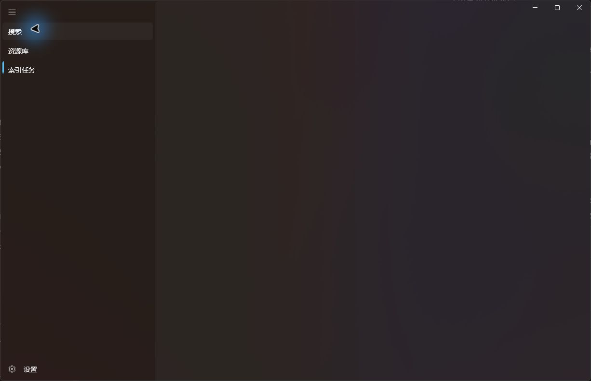
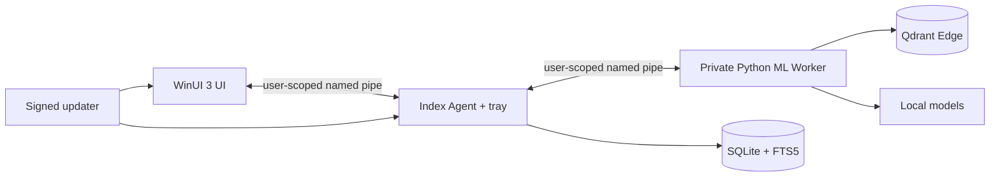

<p align="right"><a href="README.md">简体中文</a> · <strong>English</strong></p>

# MLCCS Video Search

<p align="center">
  
</p>

<p align="center">
  Local video semantic search for Windows 10 and 11.<br>
  Find video moments by filename, visual content, speech, and on-screen text while keeping indexing and search data on your machine by default.
</p>

<p align="center">
  
  
  
  
</p>



> [!WARNING]
> This project is still under active development and optimization. The current version may contain stability, compatibility, and functional issues and should not be treated as a mature product for critical data workflows. Bug reports, change requests, and improvement suggestions are welcome through GitHub Issues.

## Demo video

[▶ Play or download the sample demo (MP4, approximately 33.5 MiB)](samples/mlccs-video-search-demo.mp4)

This recording was captured during the final Windows acceptance phase and is stored in the repository to demonstrate the indexing, library, and search experience.

## Features

- Local video libraries with multiple local or network folders and exact library filtering.
- Multimodal retrieval combining filenames, visual semantics, speech transcripts, OCR text, and phonetic recall.
- High-throughput indexing with seek-based sampling, parallel videos, adaptive CUDA batches, and automatic batch reduction after GPU memory pressure.
- Streaming library UI that generates previews for visible items instead of decoding all thumbnails at once.
- Recoverable background work: the Agent persists queues, checkpoints, and failures, and indexing survives UI shutdown.
- Local-first privacy: media, queries, transcripts, and vectors are not uploaded; diagnostics are submitted only after explicit user consent.
- Verifiable distribution: the online installer validates the size and SHA-256 of each component and supports resume, pause, cancellation, and uninstall.

## Installation

The current public test build is `0.3.0-feedback5`:

[Download the Windows online installer](https://lixinchen.ca/docs/mlccs-video-search/0.3.0-feedback5/MLCCS-VideoSearch-Online-Setup.exe)

- Platform: Windows 10/11 x64.
- Installer size: `143,943,908` bytes.
- Installer SHA-256: `8350e9e39062f88ffda1f46def307300575f84c76eea2284829f311ed5e89962`.
- First-run installation downloads the application core, private runtime, visual model, and optional OCR models selected by the user.
- Speech indexing requires a compatible NVIDIA GPU with CUDA capability. System-wide Python, FFmpeg, and the .NET SDK are not prerequisites.

See [publication/publication-record.json](publication/publication-record.json) for the complete publication record and component hashes.

## Acceptance results

`0.3.0-feedback5` has completed Windows validation covering builds, startup, IPC, exact library filtering, network-drive indexing, checkpoint recovery, and weak-network installer behavior:

- Full Windows build: 0 warnings and 0 errors.
- C# Core: 10/10 tests passed.
- Python Worker, protocols, and schemas: 10/10 tests passed.
- A like-for-like CUDA benchmark over six ten-minute videos improved from `9.478 fps` to `26.392 fps`.
- A real network-library run reached `20.28 fps`; the corrected build resumed indexing at `72.7%` after restart.
- The online installer passed forced disconnect recovery, cross-process resume, pause-with-zero-growth, no-Range fallback, and final hash verification.

These results document tested scenarios; they do not remove the development-stage warning above. See [FEEDBACK5_ACCEPTANCE.md](FEEDBACK5_ACCEPTANCE.md) and the [Windows acceptance report](evidence/windows-acceptance/WINDOWS_ACCEPTANCE_REPORT.md) for evidence and remaining limitations.

## Architecture



- The UI owns interaction, not long-running indexing work.
- The Agent manages discovery, durable queues, checkpoints, and process lifecycle.
- The Worker owns FFmpeg probing, visual/speech/OCR inference, and local vector retrieval.
- SQLite is the authoritative metadata store; Qdrant collections can be rebuilt from deterministic segment records.

See [ARCHITECTURE.md](ARCHITECTURE.md) for the full design.

## Building from source

Development and release builds require Windows 10/11 x64. The repository contains locked .NET, Python dependency, and model manifests:

```powershell
Set-ExecutionPolicy -Scope Process Bypass -Force
& .\scripts\Bootstrap-Windows.ps1
& .\scripts\Build-PrivateRuntime.ps1
& .\scripts\Build-Windows.ps1 -Configuration Release
```

Related documentation:

- [BUILD_WINDOWS.md](BUILD_WINDOWS.md): toolchain, private runtime, and complete build gate.
- [PORTABLE_RELEASE.md](PORTABLE_RELEASE.md): portable release creation and checks.
- [MODELS_AND_LICENSES.md](MODELS_AND_LICENSES.md): model sources, versions, and licenses.
- [WINDOWS_ACCEPTANCE.md](WINDOWS_ACCEPTANCE.md): centralized acceptance checklist.

## Repository layout

| Path | Purpose |
|---|---|
| `src/MLCCS.VideoSearch.UI` | Single-instance WinUI 3 desktop interface |
| `src/MLCCS.VideoSearch.Agent` | Background indexing queue and tray host |
| `src/MLCCS.VideoSearch.Core` | Protocol, storage, indexing, search, privacy, and update logic |
| `src/MLCCS.VideoSearch.Updater` | Updater with health checks and rollback |
| `worker` | Private Python ML Worker and locked manifests |
| `installer` | Windows online installer |
| `schemas` | Versioned JSON contracts |
| `tests` | C#, Python, schema, and installer tests |
| `evidence` | Windows acceptance records, performance samples, and screenshots |

## Security and privacy

- Inter-process messages use a fixed protocol version and a 1 MiB frame limit.
- Update manifests and archives must both pass signature and hash verification.
- Persistent mutations use SQLite transactions or same-volume atomic replacement.
- The repository contains no production signing private keys, user index databases, model caches, or user media libraries.
- The sample screen recording is an explicitly approved public project demo asset.

Third-party dependencies and models remain under their respective licenses. Review `worker/licenses`, the lock manifests, and [MODELS_AND_LICENSES.md](MODELS_AND_LICENSES.md) before redistribution. The repository does not currently declare an additional open-source license covering all original source code.
